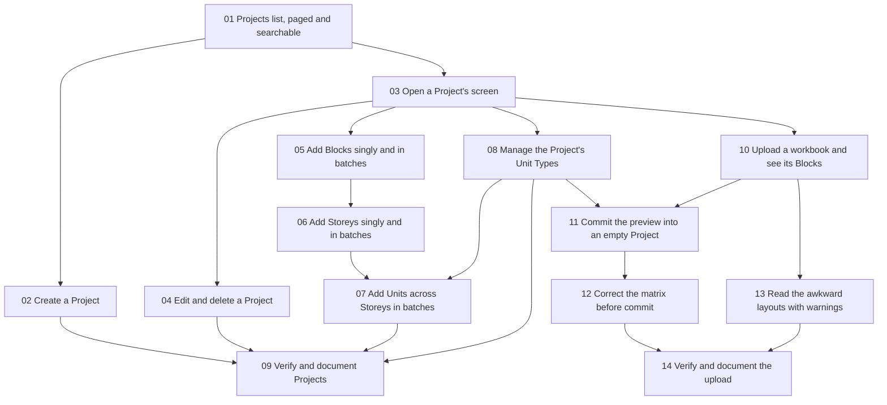

# Ticket dependency graph

Canonical tickets: `.scratch/projects/issues/` (snapshot in `./issues/`).
Every ticket is `ready-for-agent`. A ticket may start when every ticket it
is blocked by is merged.

## Waves for parallel execution

Each wave starts only when the previous wave's tickets are merged to the
integration branch. Tickets within a wave touch disjoint files except where
noted.

| Wave | Tickets | Parallelism notes |
|---|---|---|
| 0 | 01 | Alone. Owns the Prisma migration for all five models, the seed, the shared name-key module, the list route, the e2e fake skeleton. Everything else depends on it. |
| 1 | 02, 03 | 02 adds the create route and form; 03 adds the read route, layout route and Structure/Unit Types tabs. Both add routes to the same router file and the same OpenAPI registry, so expect a small merge in those two files. |
| 2 | 04, 05, 08, 10 | 04 and 05 both edit the Project layout header area (04 adds Edit/Delete actions, 05 the Blocks pane); 05 builds `BatchNamesForm`, which 06 and 07 reuse; 08 edits the Unit Types tab; 10 adds a new route file and a new screen. 10 adds SheetJS and multer to the backend package. |
| 3 | 06, 11, 13 | 06 reuses 05's form; 11 adds the commit route and edits 10's screen; 13 extends 10's parser and adds warnings to 10's accordion. 11 and 13 both edit the upload screen, so run them in separate worktrees and merge 13 second. |
| 4 | 07, 12 | 07 needs 06 and 08; 12 needs 11. Independent of each other. |
| 5 | 09, 14 | Verification passes. Independent of each other. |

## Shared files that every wave touches

Merges are most likely in these; rebase early.

- Backend: the v1 router index, the OpenAPI registry, the Prisma schema
  (only ticket 01 should change it), the dev seed, the projects schema,
  service, controller and route modules.
- Frontend: the generated route tree (never hand-edit; regenerate by
  running the dev server), both locale JSON files (typed keys; every new
  key must land in en-US and zh-CN), the projects feature module, the
  browser-edge fake for the Projects API.
